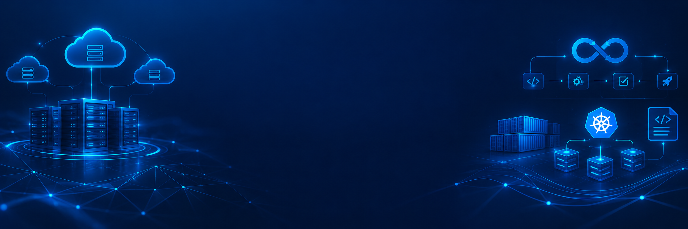

  

<h1 align="center">Hi 👋, I'm Subham Bisoyi</h1>

<h3 align="center">
  Aspiring AWS | Multi-Cloud | DevOps Engineer
</h3>

  
  
  
  

---

## 🚀 About Me

I'm an aspiring **Cloud & DevOps Engineer** focused on designing, automating, deploying, and monitoring scalable cloud infrastructure.

* ☁️ Building hands-on experience with **AWS Cloud**
* 🔧 Learning and implementing **DevOps practices and automation**
* 🔄 Building **CI/CD pipelines** for application deployment
* 🐳 Working with **Docker and containerized applications**
* ☸️ Exploring **Kubernetes and container orchestration**
* 🏗️ Practicing **Infrastructure as Code with Terraform**
* 🌍 Exploring **Multi-Cloud architecture**
* 🐙 Using **Git & GitHub** for version control and collaboration
* 🐍 Deploying **Python applications on AWS**
* 📚 Continuously learning Cloud, DevOps, Linux, networking, and automation

---

## ☁️ Cloud & DevOps Skills

### Cloud Platforms

  
  
  

### AWS Services

  
  
  
  
  
  
  
  
  
  
  
  

### DevOps & Automation

  
  
  
  
  
  
  

### Programming & Scripting

  
  
  

---

## 🏗️ Featured Projects

### ☁️ Automated GitOps & CI/CD Pipeline for Multi-Cloud Microservices

**Technologies:** AWS • Git • GitHub Actions • Docker • Kubernetes • Terraform • CI/CD

A cloud-native deployment platform designed to automate the build, test, containerization, infrastructure provisioning, and deployment of microservices.

**Key Components:**

* Source code management with Git/GitHub
* Automated CI/CD pipeline
* Docker-based microservices
* Kubernetes orchestration
* Infrastructure provisioning with Terraform
* AWS cloud infrastructure
* GitOps-based deployment workflow
* Auto
